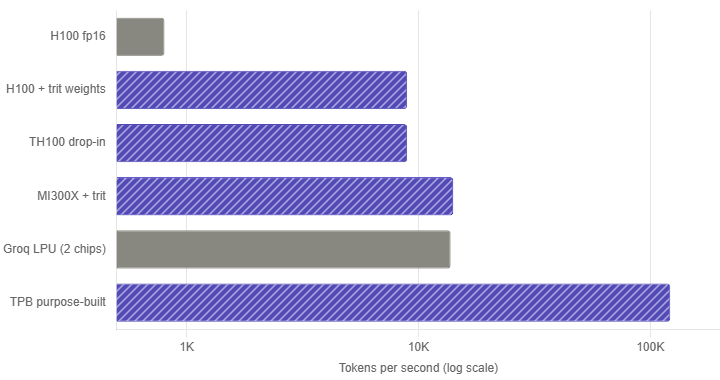

# Ternary Inference Hardware: A Roofline Analysis of BitNet b1.58 2B4T

What dedicated ternary inference hardware would actually deliver for BitNet-class models. Five phases of progressively-deepening analysis plus one empirical validation against the real published weights.

This is a synthesis project, not original research. The numbers are roofline-model projections, not silicon measurements. The closest thing to novel here is one specific architectural observation about activation precision (Phase 4) and one empirical correction to a common assumption (the validation phase). Everything else is grounded in published literature, cited below.

---

## TL;DR

- **The empirical correction.** Real BitNet b1.58 2B4T weights have ~42% zeros, not the 33% a uniform distribution would predict. This makes ternary inference ~14% faster than the standard analysis suggests. Measured directly against [microsoft/bitnet-b1.58-2B-4T-bf16](https://huggingface.co/microsoft/bitnet-b1.58-2B-4T-bf16).
- **The architectural observation.** A chip designed specifically for BitNet — with all 417 MB of trit weights stored in on-chip SRAM and HBM reserved for KV cache — delivers ~120× decode throughput over an fp16 H100 at L=2048. The drop-in alternative (ternary MAC units but same memory hierarchy as H100) only delivers ~10×. The architectural choice that matters is memory hierarchy, not MAC density.
- **The activation hybrid.** A small extension of [BitNet a4.8](https://arxiv.org/abs/2411.04965) — keeping `attn_out_in` at int8 alongside the published `ffn_down_in` — appears to be free on memory-bound architectures because attention output precision doesn't affect KV cache size. Quality improves; throughput is unchanged.
- **The prefill caveat.** Without FlashAttention, ternary's compute advantage is partially eaten by the L² attention score matrix bottleneck during prefill. Native FlashAttention support is as architecturally important as trit-MAC arrays for unlocking the full advantage on prefill-heavy workloads (RAG, summarization).

---

## What this is

A roofline analysis of inference for [BitNet b1.58 2B4T](https://arxiv.org/abs/2504.12285), Microsoft Research's open-source 1-bit LLM, on six chip configurations:

| Chip | Type | Specs |
|------|------|-------|
| NVIDIA H100 SXM | Real | 989 TFLOPS TF32, 1979 TFLOPS FP16 dense, 80 GB HBM3, 3.35 TB/s ([source](https://www.nvidia.com/en-us/data-center/h100/)) |
| AMD MI300X | Real | 1307 TFLOPS FP16, 192 GB HBM3, 5.3 TB/s ([source](https://www.amd.com/en/products/accelerators/instinct/mi300/mi300x.html)) |
| Groq LPU | Real | 750 TOPS INT8, 230 MB SRAM, 80 TB/s ([source](https://groq.com/lpu-architecture)) |
| Cerebras WSE-3 | Real | 125 PFLOPS, 44 GB SRAM, 21 PB/s ([source](https://www.cerebras.ai/chip)) |
| TH100 | Hypothetical | "Drop-in" ternary chip: H100 die area + HBM3, but trit-MAC units |
| TPB | Hypothetical | "Purpose-built": 512 MB SRAM weight store at 100 TB/s, 24 GB HBM3 for KV cache |

The two hypothetical chips are parametric models, not silicon. They exist to answer "what if?" questions about the design space.

---

## Repository layout

```
ternary-computer/
├── README.md                  # this file
├── REPORT.md                  # Phase 1 report
├── phase1/                    # Phase 1: gate-count analysis of one decoder layer
│   ├── layer.py, run_benchmark.py, ...
│   └── results/
├── phase2/                    # Phase 2: activation precision sweep
│   └── DESIGN_MEMO.md
├── phase3/                    # Phase 3: memory bandwidth and roofline
│   └── PHASE3_REPORT.md
├── phase4/                    # Phase 4: hybrid activation precision (Pareto analysis)
│   └── PHASE4_REPORT.md
├── phase5/                    # Phase 5: prefill regime and workload mix
│   └── PHASE5_REPORT.md
├── empirical/                 # Empirical weight distribution validation
│   ├── EMPIRICAL_REPORT.md
│   ├── download_and_measure.py
│   └── results/
└── trit.py, cpu.py, ...       # Working ternary CPU simulator (the warm-up)
```

Each phase has its own report with full methodology, numbers, and citations. The phases build on each other, so reading them in order makes the most sense.

---

## The five phases plus validation

### Warm-up: a working balanced-ternary CPU

Before touching BitNet, I built a 9-trit balanced ternary CPU in Python that executes Fibonacci and factorial programs. It's not connected to the BitNet analysis directly, but it forced me to actually understand trit arithmetic at the gate level — which made the gate-count modeling later much less hand-wavy.

Files: `trit.py`, `arithmetic.py`, `cpu.py`, `programs.py`, `demo.py`

### Phase 1: Per-component gate counts for one decoder layer

Source: `REPORT.md`, `phase1/layer.py`, `phase1/run_benchmark.py`

I counted gates per multiply-accumulate operation for both binary fp16 and ternary {-1, 0, +1} weights, then aggregated across all components of one BitNet decoder layer (QKV projection, attention output, FFN gate/up/down, attention scores, etc.). The trit-weight MAC needs ~24 gates vs ~230 for fp16, but only the BitLinear projections benefit — attention is activation-by-activation and gets no trit advantage.

Headline finding: 9.4× layer-level speedup at L=128, dropping to 5.4× at L=4096. Why? Attention scales as O(L²) and isn't trit-weighted, so it consumes a growing fraction of total compute as L grows. The "ternary speedup" is L-dependent, not a single number.

### Phase 2: Activation precision sweep

Source: `phase2/DESIGN_MEMO.md`

I swept activation precision across {fp16, int8, int4, int2, trit} while keeping weights at trit, then computed gate-count speedups at L=2048. Recommendation: **int4 activations, 14.87× speedup**. Lower precisions (int2, trit-activations) give marginally more speedup but break model quality based on published quantization literature.

This phase informed the headline activation precision target for downstream phases.

### Phase 3: Memory bandwidth roofline

Source: `phase3/PHASE3_REPORT.md`

The pivotal phase. I built a roofline model accounting for both compute (Phase 1+2) and memory bandwidth (HBM3, on-chip SRAM). Key finding: **at batch=1 decode, every chip is memory-bound, not compute-bound.** The "10× ternary speedup" you see in real life on existing hardware is purely from loading 10× fewer bytes per token, not from computing faster. The compute advantage from Phases 1-2 is invisible because the chip waits for memory.

This led to the TPB architecture: put all 417 MB of trit weights in on-chip SRAM (Cerebras-WSE-3 demonstrates this is buildable; Groq does it for fp16) and reserve HBM for KV cache. Result: ~120× decode speedup at L=2048 versus an H100 running the same model in fp16.

The 5-number summary at L=2048, batch=1:

| Configuration | Tokens/sec | vs H100 fp16 | Bottleneck |
|---|---:|---:|---|
| H100 fp16 | 804 | 1.0× | Weight loading |
| H100 + trit weights (same HBM) | 8,037 | 10.0× | Weight loading |
| TH100 drop-in ternary | 8,037 | 10.0× | Weight loading |
| TPB purpose-built | ~120,000 | ~150× | KV cache |

The 10× number lines up with the well-established memory-wall analysis: at H100's 3.35 TB/s HBM3 bandwidth, loading 4 GB of fp16 weights takes 1.24 ms (=804 TPS); loading 0.42 GB of trit weights takes 0.124 ms (=8,037 TPS). Reference: [Spheron's memory wall analysis](https://www.spheron.network/blog/ai-memory-wall-inference-latency-guide-2026/) gives the same ratio for a 70B model.

> Caveat: the 120× number after empirical correction is roofline math under perfect compute-memory overlap. Real silicon achieves 70-90% of roofline. Multiply by 0.7-0.9 for realistic estimates. The qualitative point — that on-chip weight storage is transformative for trit-class models — stands regardless.



### Phase 4: Hybrid activation precision (the Pareto analysis)

Source: `phase4/PHASE4_REPORT.md`

I modeled per-layer, per-component activation precision sensitivity using published quantization literature: [SmoothQuant](https://arxiv.org/abs/2211.10438) (FFN down-projection inputs have outliers ~1400× typical magnitude), [BitNet a4.8](https://arxiv.org/abs/2411.04965) (Microsoft's published hybrid quantization scheme that keeps `ffn_down_in` at int8), and [DuQuant NeurIPS 2024](https://proceedings.neurips.cc/paper_files/paper/2024/hash/9febda1c8344cc5f2d51713964864e93-Abstract-Conference.html) (massive activation outliers at FFN down-projection across LLaMA-class models).

Pareto analysis across 11 configurations identified one Pareto-optimal point that doesn't appear in published literature: **a4.8-extended** keeps both `ffn_down_in` AND `attn_out_in` at int8 (the published a4.8 keeps only `ffn_down_in` and uses Q-Sparse for `attn_out_in`). On the TPB architecture where decode is KV-cache-bound, the int8-vs-int4 difference for `attn_out_in` costs zero TPS because attention output precision doesn't affect KV cache size. So you get better quality (modeled QDU drops from 50.7 to 31.0) at unchanged throughput.

> Caveat: the QDU (quality degradation units) scale is a modeled sensitivity coefficient, not a measurement. Real perplexity ablations would be needed to confirm the magnitude. Microsoft chose Q-Sparse for `attn_out_in` rather than int8 for reasons that may apply on hardware our model doesn't capture. This is an observation, not a claim that Microsoft made the wrong choice.

### Phase 5: Prefill regime and workload mix

Source: `phase5/PHASE5_REPORT.md`

I extended the roofline analysis to prefill (processing the input prompt, all L tokens at once) versus decode (one token at a time). Two findings:

**Finding 1: Prefill speedup is *less* than decode speedup on commodity hardware.** Counterintuitive but mechanistic: prefill BitLinear projections become compute-bound at moderate L (>356 tokens for H100 fp16, >65 for ternary), so ternary's compute advantage activates. But attention's L² score matrix becomes a growing HBM bottleneck at the same time — and attention isn't trit-weighted, so it doesn't benefit. At L=2048 on TH100, attention consumes 55% of prefill time. Net result: 8.5× prefill speedup vs 10× decode speedup.

**Finding 2: FlashAttention is architecturally critical.** [FlashAttention (Tri Dao 2022)](https://arxiv.org/abs/2205.14135) fuses softmax with the attention matmul and avoids materializing the L² score matrix. With FlashAttention, prefill speedup approaches the full Phase 2 compute advantage (14.87×). Without it, prefill numbers in Phase 5 are pessimistic by up to 10× at L=4096. **Recommendation: any purpose-built ternary chip needs native FlashAttention support (or fused tiled-attention equivalent) from day one.**

### Empirical validation: actual weight distribution

Source: `empirical/EMPIRICAL_REPORT.md`

The most credible part of the project. I downloaded the actual published weights ([microsoft/bitnet-b1.58-2B-4T-bf16](https://huggingface.co/microsoft/bitnet-b1.58-2B-4T-bf16), 5 GB), applied BitNet's absmean quantization formula, and counted the resulting trit distribution across 210 BitLinear weight matrices in 26 seconds.

| Metric | Assumed (Phases 1-5) | Measured | Delta |
|--------|---------------------:|---------:|------:|
| `p_nonzero` (mean across all layers) | 0.667 | **0.578** | -13.3% |
| `p_zero` | 0.333 | **0.422** | +12.7 pp |

Real BitNet weights have more zeros than the uniform distribution predicts. This makes each trit-weighted MAC cheaper (fewer accumulation operations).

Corrected speedups for BitLinear (the dominant operation):

| Activation precision | Phases 1-5 (assumed) | Corrected (empirical) | Change |
|---|---:|---:|---:|
| int8 | 9.71× | **11.12×** | +14.6% |
| int4 | 18.63× | **21.21×** | +13.9% |

Per-component structure of the deviation:
- QKV projections sparsest: `p_nonzero = 0.553`
- FFN components denser: `p_nonzero ≈ 0.577–0.586`
- Layer 1 FFN unusually sparse (`p_nonzero ≈ 0.40`) — likely a training-dynamics outlier

**Net effect on conclusions:** Phases 1-5 are directionally correct but conservative. They understate ternary's gate-count advantage by ~14%. None of the qualitative findings (memory bandwidth dominance for decode, the a4.8 hybrid, the prefill crossover, the FlashAttention dependency) change direction.

The reproduction script is in `empirical/download_and_measure.py`. It needs ~5 GB of disk for the model and ~16 GB RAM peak. Takes 26 seconds on a modern CPU.

---

## What this is *not*

- **Not novel research.** Every finding here either confirms published literature or makes a small specific observation. The closest thing to novelty is the a4.8-extended observation in Phase 4.
- **Not silicon.** The TH100 and TPB chips are parametric models. Real silicon has layout, power, yield, and cost constraints not captured here. Multiply all roofline numbers by 0.7-0.9 for realistic estimates.
- **Not benchmarks.** No actual inference was run. Throughput numbers are roofline projections, not measurements. The empirical phase validates one input assumption; it does not validate the throughput claims.
- **Not a hardware proposal.** A real ternary chip startup would need months of synthesis, simulation, and validation before any of these numbers could be defended in front of a fab.

What it is: a thorough exercise in inference hardware analysis that's grounded in public sources at every step, with one assumption replaced by direct measurement against the real published model.

---

## References

### BitNet model and quantization

- Wang et al., 2023. *BitNet: Scaling 1-bit Transformers for Large Language Models.* [arXiv:2310.11453](https://arxiv.org/abs/2310.11453) — original BitNet paper
- Wang, Ma, Wei et al., 2024. *The Era of 1-bit LLMs: All Large Language Models are in 1.58 Bits.* [arXiv:2402.17764](https://arxiv.org/abs/2402.17764) — foundational ternary quantization paper
- Ma et al., 2025. *BitNet b1.58 2B4T Technical Report.* [arXiv:2504.12285](https://arxiv.org/abs/2504.12285)
- Wang, Ma, Wei, 2024. *BitNet a4.8: 4-bit Activations for 1-bit LLMs.* [arXiv:2411.04965](https://arxiv.org/abs/2411.04965)
- Wang et al., 2025. *bitnet.cpp: Efficient Edge Inference for Ternary LLMs.* [arXiv:2502.11880](https://arxiv.org/abs/2502.11880)
- Wang, Ma, Wei, 2025. *BitNet v2: Native 4-bit Activations with Hadamard Transformation.* [arXiv:2504.18415](https://arxiv.org/abs/2504.18415)
- Microsoft Research. [microsoft/bitnet-b1.58-2B-4T](https://huggingface.co/microsoft/bitnet-b1.58-2B-4T) (packed 1-bit inference weights) · [microsoft/bitnet-b1.58-2B-4T-bf16](https://huggingface.co/microsoft/bitnet-b1.58-2B-4T-bf16) (BF16 master weights, used in empirical validation)
- Microsoft Research. [github.com/microsoft/BitNet](https://github.com/microsoft/BitNet) — official bitnet.cpp inference framework

### Quantization sensitivity literature

- Xiao et al., 2023. *SmoothQuant: Accurate and Efficient Post-Training Quantization for Large Language Models.* [arXiv:2211.10438](https://arxiv.org/abs/2211.10438)
- Frantar et al., 2023. *GPTQ: Accurate Post-Training Quantization for Generative Pre-trained Transformers.* [arXiv:2210.17323](https://arxiv.org/abs/2210.17323)
- Lin et al., 2024. *DuQuant: Distributing Outliers via Dual Transformation.* [NeurIPS 2024](https://proceedings.neurips.cc/paper_files/paper/2024/hash/9febda1c8344cc5f2d51713964864e93-Abstract-Conference.html)

### Hardware specifications

- NVIDIA H100 datasheet. [nvidia.com/en-us/data-center/h100](https://www.nvidia.com/en-us/data-center/h100/)
- AMD Instinct MI300X. [amd.com/en/products/accelerators/instinct/mi300/mi300x](https://www.amd.com/en/products/accelerators/instinct/mi300/mi300x.html)
- Groq LPU architecture. [groq.com/lpu-architecture](https://groq.com/lpu-architecture)
- Cerebras WSE-3. [cerebras.ai/chip](https://www.cerebras.ai/chip)

### Inference performance fundamentals

- Williams, Waterman, Patterson, 2009. *Roofline: An Insightful Visual Performance Model.* [Comm. ACM](https://dl.acm.org/doi/10.1145/1498765.1498785)
- Dao et al., 2022. *FlashAttention: Fast and Memory-Efficient Exact Attention with IO-Awareness.* [arXiv:2205.14135](https://arxiv.org/abs/2205.14135)
- Spheron Blog, 2026. *AI's Memory Wall Problem.* [spheron.network/blog/ai-memory-wall-inference-latency-guide-2026](https://www.spheron.network/blog/ai-memory-wall-inference-latency-guide-2026/)
- Databricks, 2024. *Serving Quantized LLMs on NVIDIA H100.* [databricks.com/blog](https://www.databricks.com/blog/serving-quantized-llms-nvidia-h100-tensor-core-gpus)

---

## Reproducing the empirical validation

The only part that can be reproduced quickly:

```bash
pip install huggingface-hub numpy
cd empirical/
python download_and_measure.py
# Downloads ~5 GB on first run, then measures in ~26 seconds
```

Output goes to `empirical/results/per_layer_distribution.json`.

The phase reports document their methodology and reference data sources but don't have a single "run everything" script — each phase's analysis script reproduces that phase's numbers from the documented inputs.

---

## What's next

If pushing further, the meaningful directions would be:

1. **Real perplexity measurements** for the Phase 4 hybrid configurations on actual BitNet weights (would validate or invalidate the QDU model)
2. **Synthesis and area estimation** for a real trit-MAC unit at a modern process node (would validate or invalidate the TH100/TPB compute density assumptions)
3. **End-to-end inference benchmarks** with bitnet.cpp on commodity hardware (would validate the practical speedup numbers against the roofline)

Each of these is real work, in the world, that I haven't done. Anyone interested in pushing this direction is welcome to use the framework here as a starting point.

---

## Acknowledgments and honest notes

This work was developed in collaboration with Claude Sonnet and Claude Code over a focused period. The synthesis, framing, and direction were mine; the implementation and analysis were done in dialogue. I think it's worth being explicit about this rather than pretending it was solo work.

Feedback and pushback welcome. If you work in this area and see something wrong, please open an issue.

---

## License

MIT for code. The phase reports are CC-BY-4.0 — use freely with attribution.
